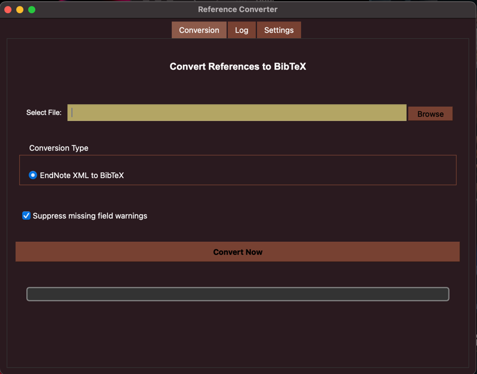

# EndNote XML to BibTeX Converter

A streamlined desktop application that converts EndNote XML reference files to BibTeX format for seamless integration with LaTeX projects.



## Motivation

This project was born out of a common academic workflow challenge: transitioning between document preparation systems while maintaining a consistent reference library.

When working with Microsoft Word, EndNote is a powerful reference management tool. However, when switching to LaTeX for its superior mathematical typesetting, you need references in BibTeX format. Rather than manually recreating your reference library, this tool allows you to export your EndNote references as XML and convert them directly to BibTeX format.

## Features

- **Simple Conversion**: Convert EndNote XML files directly to BibTeX format with a single click
- **Two Conversion Modes**:
  - **Standard Conversion**: Fast processing using only data from your XML file
  - **Enhanced Conversion**: Enriches references by fetching missing metadata from external APIs (Semantic Scholar & CrossRef)
- **Real-time Progress Tracking**: Watch conversion progress with detailed status updates and cancellation support
- **Duplicate Detection & Removal**: Automatically identifies and removes duplicate references, keeping the highest quality version
- **Unique Key Generation**: Ensures all BibTeX keys are unique with intelligent naming and automatic numbering
- **Styled Text Support**: Preserves formatting from EndNote styled text in the conversion process
- **Field Mapping**: Intelligently maps EndNote fields to appropriate BibTeX fields
- **Reference Preview**: Preview converted BibTeX entries before saving with real-time log updates
- **Flexible Saving Options**: Save directly to a file or to a selected directory
- **Warning Suppression**: Option to suppress warnings about missing fields
- **Detailed Logging**: Comprehensive logging for troubleshooting and tracking conversions
- **Dynamic BibTeX String Generation**: Automatically identifies and categorizes journals and publishers for optimal BibTeX formatting
- **Smart Publication Recognition**: Identifies and properly formats conference proceedings, journals, and other publication types
- **Cross-platform Compatibility**: Works on Windows, macOS, and Linux with native file dialogs

## Installation

### Prerequisites

- Python 3.6+
- PyQt5

### Optional Dependencies (for Enhanced Mode)

For the enhanced conversion mode that fetches missing metadata from external APIs:

```
pip install requests fuzzywuzzy python-Levenshtein
```

### Setup

1. Clone the repository:

   ```
   git clone https://github.com/Hetawk/endnote-to-bibtex.git
   cd endnote-to-bibtex
   ```

2. Install dependencies:

   ```
   pip install -r requirements.txt
   ```

3. Run the application:
   ```
   python main.py
   ```

## Usage

### Converting EndNote XML to BibTeX

1. **Export from EndNote**:

   - In EndNote, select the references you want to export
   - Go to `File > Export`
   - Choose `XML` as the output format
   - Save the file to your computer

2. **Convert to BibTeX**:

   - Launch the EndNote XML to BibTeX Converter
   - Click `Browse` to select your EndNote XML file
   - Click `Convert Now`
   - Review the preview of your BibTeX entries
   - Click `Save As...` to save the BibTeX file or `Save to Directory` to save to a specific folder

3. **Use in LaTeX**:
   - In your LaTeX document, add: `\bibliography{your_bibtex_file}` (without the .bib extension)
   - Use `\cite{key}` to cite references
   - Compile with BibTeX to generate your bibliography

## Settings

- **Suppress missing field warnings**: Ignores warnings for non-critical missing fields
- **Extract styled text**: Extracts and preserves text style information from EndNote XML
- **Default Save Directory**: Set a preferred location for saving BibTeX files
- **BibTeX Output Style**: Choose between standard BibTeX format or enhanced ACM-style format with automatic string definitions

## Technical Details

The application uses a specialized XML parser to handle EndNote's XML format and create properly formatted BibTeX entries. It preserves all essential metadata including:

- Authors
- Title
- Journal/Book information
- Year and publication details
- DOI, URL, and other identifiers
- Abstract and keywords
- Publisher information

The BibTeX String generation system automatically:

- Identifies journal names and abbreviations from your data
- Categorizes publications based on naming patterns and content
- Groups similar journals and publishers together
- Generates optimal BibTeX String definitions for consistent references
- Handles both known and new publication venues without manual configuration

## Contributing

Contributions are welcome! Please feel free to submit a Pull Request.

## License

This project is licensed under the MIT License - see the LICENSE file for details.

## Acknowledgments

- Inspired by the workflow needs of researchers and academics transitioning between Word and LaTeX
- Built with PyQt5 for a cross-platform desktop experience
